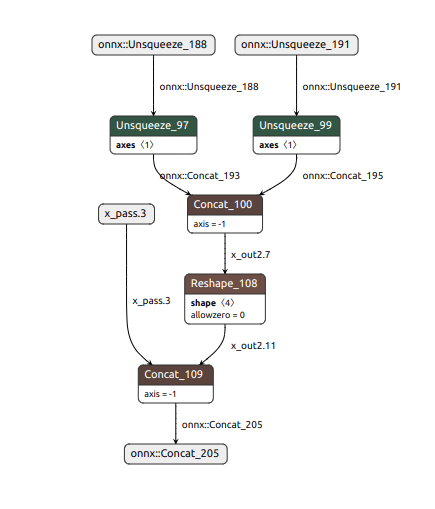
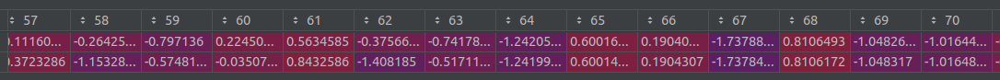
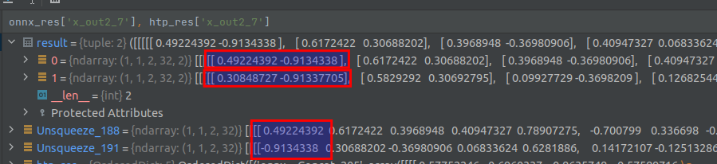
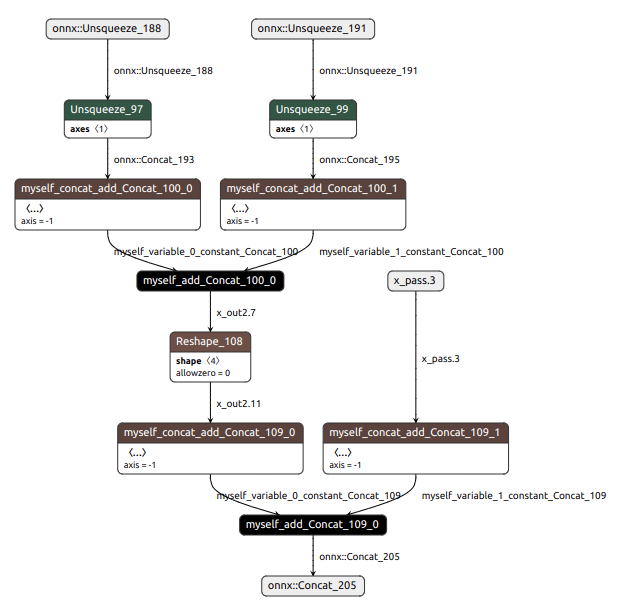
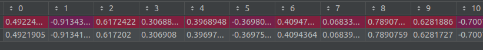

## QNN concat 算子精度损失问题
### QNN SDK版本（2.17.0.231124）

#### 模型结构  

#### 模型逻辑  
onnx::Unsequeeze_188和onnx::Unsequeeze_191 tensor先Unsquzze然后拼接，再变一下形状和x_pass.3 tensor拼接起来。
由于图示显示原因，有必要说明一下，Concat_109算子的concat参数顺序是x_out2.11在前，x_pass.3在后。

#### 精度损失复现步骤  
根据资源文件里的模型和脚本数据转化模型(模型转化需要QNN相关基础知识，
参考[官方文档](https://developer.qualcomm.com/software/qualcomm-ai-engine-direct-sdk))，
然后用demo_concat.py脚本推理，对比模型精度差异。项目里已经提供必要的模型，方便复现。

#### 精度差异分析  
  
根据demo结果可以发现，从64位开始，前面部分出现精度损失和onnx测跑结果差异较大，后半部分结果一致。也就是说，x_out2.11 tensor
出现精度损失。进一步分析发现x_out2.7就已经有精度损失。 

由图可知，Unsqueeze_188和Unsqueeze_191 tensor经过unsqueeze操作后在最后一维拼接，onnx_res表示onnx测跑结果，显示正常。
而htp_res表示htp测跑结果显示有精度差异。仔细观察可以发现，精度差异主要在最后一维的第一个数据上，也就是Unsqueeze_188这个tensor
在拼接后出现精度损失。而Unsqueeze_191这个tensor所在的位置数据保持精度。 熟悉QNN转化过程的可以知道，QNN在转化过程中用不同的tensor
有不同的精度，而两个拼接的tensor精度在输入的时候是不同的，而拼接完之后精度统一。猜测精度损失是由concat没有对入参做精度对齐操作导致的。
当然也许有其它原因，本项目就不对这个猜测做验证。

#### 解决方案  
思路:既然concat操作有精度损失，而在QNN官方未解决此bug之前，我们只能自己想办法解决，也许有些人在这里就放弃QNN，而改用其它框架，
但对我来说，QNN的速度实在确实惊艳，对端侧产品性能提升巨大，QNN也在慢慢完善，总之，一切都是值得的。所以，我们可以替换一些没有精度损失的算子来规避。
我这里替换两个tensor的直接concat操作，改为每个tensor先和0拼接，然后用加的操作达到同一目的。 因为量化过程中会保持0精度不变，所以两个tensor和0的拼接操作
不会有精度损失，而add操作，高通对这个算子的入参是做了精度对齐的，所以出来的结果也是正确的。模型修改参考modify_model.py  

修改后模型：  

修改后结果：  

